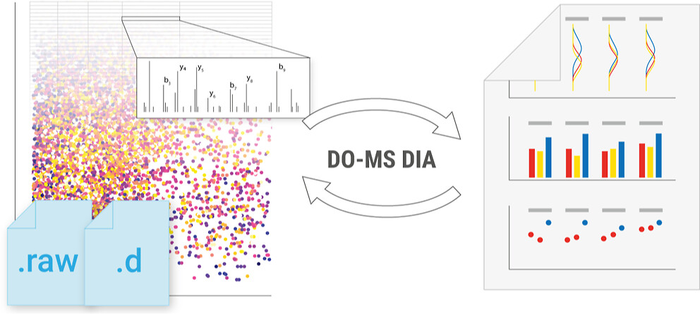



# plexDIA optimization
## Data-Driven Optimization of DIA Mass Spectrometry by DO-MS

&nbsp;

[Research Article][plexDIA_DO-MS_Article]{: .btn .fs-5 .mb-4 .mb-md-0 .mr-2 }
[Github code](https://github.com/SlavovLab/DO-MS){: .btn .fs-5 .mb-4 .mb-md-0 .mr-2 }

&nbsp;

[{: width="80%" .center-image}][plexDIA_DO-MS_Article]

----

Mass spectrometry (MS) enables specific and accurate quantification of proteins with ever-increasing throughput and sensitivity. Maximizing this potential of MS requires optimizing data acquisition parameters and performing efficient quality control for large datasets. To facilitate these objectives for data-independent acquisition (DIA), we developed a second version of our framework for data-driven optimization of MS methods (DO-MS). The DO-MS app v2.0 (do-ms.slavovlab.net) allows one to optimize and evaluate results from both label-free and multiplexed DIA ([plexDIA](https://www.nature.com/articles/s41587-022-01411-1)) and supports optimizations particularly relevant to single-cell proteomics. We demonstrate multiple use cases, including optimization of duty cycle methods, peptide separation, number of survey scans per duty cycle, and quality control of single-cell plexDIA data. DO-MS allows for interactive data display and generation of extensive reports, including publication of quality figures that can be easily shared. The source code is available at github.com/SlavovLab/DO-MS.

-----

Wallmann G., Leduc A., Slavov N., **Data-Driven Optimization of DIA Mass Spectrometry by DO-MS**, *J. Proteome Res.*, doi: [10.1021/acs.jproteome.3c00177][plexDIA_DO-MS_Article]; Preprint at *bioRxiv* doi: [10.1101/2023.02.02.526809][plexDIA_DO-MS_Preprint], [PDF](https://slavovlab.net/Slavov-Lab-Publications/2023_DO-MS_DIA_plexDIA_JPR.pdf)

<!--
<h2 style="letter-spacing: 2px; font-size: 26px;" id="plexDIA-data" >plexDIA data organized by experiments</h2>
All RAW and processed data from the [plexDIA article][plexDIA_Article] are organized in this [directory](https://drive.google.com/drive/folders/1yumNWViKTxMqhxDAnAW2Fm42hYd6C_Ws?usp=sharing). Below are links to processed data from single cells, cells isolated based in DNA content (cell cycle phases) and from LFQ-bench style benchmarking experiments.

 * Processed [single-cell data](https://drive.google.com/drive/folders/1pUC2zgXKtKYn22mlor0lmUDK0frgwL_-?usp=sharing)

 * Proteins x single cells [data matrix](https://drive.google.com/file/d/1_qztwEM3OxS5R6A6-N1Ai_vs60tWDLtE/view?usp=sharing)

 * Processed [cell division cycle data](https://drive.google.com/drive/folders/1xJ5ewZj-JNry36UBOMJHVn6-QolwXkZV?usp=sharingg)

 * Processed [benchmarking data](https://drive.google.com/drive/folders/1WwCOfQtvxNsT-tdR88kbwaglm1xYiqWh?usp=sharing)

&nbsp;

<h2 style="letter-spacing: 2px; font-size: 26px;" id="RAW-data" >plexDIA RAW data and search results from DIA-NN</h2>
The repositories below contain RAW mass-spectrometry data files generated by a first-generation Q-exactive instrument as well as the search results from analyzing the  RAW files by [DIA-NN](https://drive.google.com/file/d/1naoAhDX6VyvQ8Uc1ukfpcMcKzyTFbDCv/view?usp=sharing). Searching plexDIA data with DIA-NN is described in this [tutorial](https://youtu.be/0Wmg9LjDtgE).

* **MassIVE Repository for version 1 (Bulk plexDIA data):**
  - [**http:**  MSV000088302](https://massive.ucsd.edu/ProteoSAFe/dataset.jsp?task=8b0a2f5b2fc84964b4bd4ee64fc84d25)
  - [**ftp:** &nbsp; MSV000088302](ftp://massive.ucsd.edu/MSV000088302)

-->

[plexDIA_DO-MS_Article]: https://pubs.acs.org/doi/10.1021/acs.jproteome.3c00177 "plexDIA optimization: Data-Driven Optimization of DIA and multiplexed DIA (plexDIA) Mass Spectrometry by DO-MS"

[plexDIA_DO-MS_Preprint]:  https://doi.org/10.1101/2023.02.02.526809 "plexDIA optimization: Data-Driven Optimization of DIA and multiplexed DIA (plexDIA) Mass Spectrometry by DO-MS"

&nbsp;

&nbsp;  

&nbsp;

&nbsp;  

&nbsp;

&nbsp;

&nbsp;

&nbsp;

&nbsp;

&nbsp;

&nbsp;

&nbsp;

&nbsp;

&nbsp;

&nbsp;

&nbsp;

&nbsp;

&nbsp;

&nbsp;
