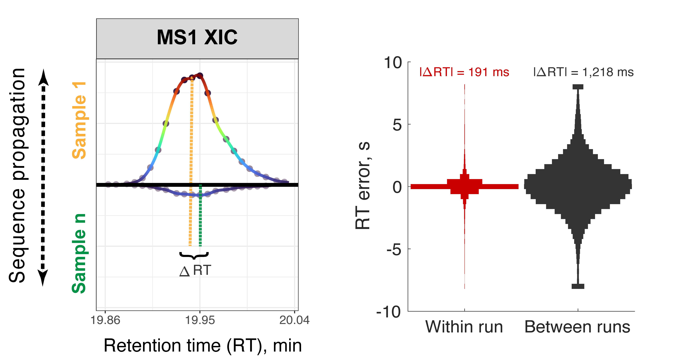



# plexDIA perspective
## Strategies for increasing the depth & throughput of protein analysis

&nbsp;

[Perspective Article][plexDIA_perspective_Article]{: .btn .fs-5 .mb-4 .mb-md-0 .mr-2 }
[Github code](https://github.com/SlavovLab/plexDIA_perspective){: .btn .fs-5 .mb-4 .mb-md-0 .mr-2 }

&nbsp;

[{: width="80%" .center-image}][plexDIA_perspective_Article]

----

Accurate protein quantification is key to identifying protein markers, regulatory relationships between proteins, and pathophysiological mechanisms. Realizing this potential requires sensitive and deep protein analysis of a large number of samples. Toward this goal, proteomics throughput can be increased by parallelizing the analysis of both precursors and samples using multiplexed data independent acquisition (DIA) implemented by the [plexDIA framework](https://www.nature.com/articles/s41587-022-01411-1). Here we demonstrate the improved precisions of RT estimates within plexDIA and how this enables more accurate protein quantification. plexDIA has demonstrated multiplicative gains in throughput, and these gains may be substantially amplified by improving the multiplexing reagents, data acquisition and interpretation. We discuss future directions for advancing plexDIA, which include engineering optimized mass-tags for high-plexDIA, introducing isotopologous carriers, and developing algorithms that utilize the regular structures of plexDIA data to improve sensitivity, proteome coverage and quantitative accuracy. These advances in plexDIA will increase the throughput of functional proteomic assays, including quantifying protein conformations, turnover dynamics, modifications states and activities. The sensitivity of these assays will extend to single-cell analysis, thus enabling functional single-cell protein analysis.

-----

Jason Derks, Nikolai Slavov, *Strategies for increasing the depth and throughput of protein analysis by plexDIA*, bioRxiv 2022.11.05.515287; doi: [10.1101/2022.11.05.515287](https://doi.org/10.1101/2022.11.05.515287)

<!--
<h2 style="letter-spacing: 2px; font-size: 26px;" id="plexDIA-data" >plexDIA data organized by experiments</h2>
All RAW and processed data from the [plexDIA article][plexDIA_Article] are organized in this [directory](https://drive.google.com/drive/folders/1yumNWViKTxMqhxDAnAW2Fm42hYd6C_Ws?usp=sharing). Below are links to processed data from single cells, cells isolated based in DNA content (cell cycle phases) and from LFQ-bench style benchmarking experiments.

 * Processed [single-cell data](https://drive.google.com/drive/folders/1pUC2zgXKtKYn22mlor0lmUDK0frgwL_-?usp=sharing)

 * Proteins x single cells [data matrix](https://drive.google.com/file/d/1_qztwEM3OxS5R6A6-N1Ai_vs60tWDLtE/view?usp=sharing)

 * Processed [cell division cycle data](https://drive.google.com/drive/folders/1xJ5ewZj-JNry36UBOMJHVn6-QolwXkZV?usp=sharingg)

 * Processed [benchmarking data](https://drive.google.com/drive/folders/1WwCOfQtvxNsT-tdR88kbwaglm1xYiqWh?usp=sharing)

&nbsp;

<h2 style="letter-spacing: 2px; font-size: 26px;" id="RAW-data" >plexDIA RAW data and search results from DIA-NN</h2>
The repositories below contain RAW mass-spectrometry data files generated by a first-generation Q-exactive instrument as well as the search results from analyzing the  RAW files by [DIA-NN](https://drive.google.com/file/d/1naoAhDX6VyvQ8Uc1ukfpcMcKzyTFbDCv/view?usp=sharing). Searching plexDIA data with DIA-NN is described in this [tutorial](https://youtu.be/0Wmg9LjDtgE).

* **MassIVE Repository for version 1 (Bulk plexDIA data):**
  - [**http:**  MSV000088302](https://massive.ucsd.edu/ProteoSAFe/dataset.jsp?task=8b0a2f5b2fc84964b4bd4ee64fc84d25)
  - [**ftp:** &nbsp; MSV000088302](ftp://massive.ucsd.edu/MSV000088302)

-->

[plexDIA_perspective_Article]:  https://doi.org/10.1101/2022.11.05.515287 "Strategies for increasing the depth and throughput of protein analysis by plexDIA"

&nbsp;

&nbsp;  

&nbsp;

&nbsp;  

&nbsp;

&nbsp;

&nbsp;

&nbsp;

&nbsp;

&nbsp;

&nbsp;

&nbsp;

&nbsp;

&nbsp;

&nbsp;

&nbsp;

&nbsp;

&nbsp;

&nbsp;
